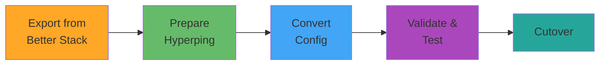

# Migrating from Better Stack to Hyperping

This comprehensive guide walks you through migrating your uptime monitoring from Better Stack (formerly Better Uptime) to Hyperping using Terraform. Whether you're managing a few monitors or hundreds, this guide provides the tools and strategies you need for a smooth transition.

## Table of Contents

- [Why Migrate?](#why-migrate)
- [Prerequisites](#prerequisites)
- [Migration Overview](#migration-overview)
- [Step-by-Step Migration](#step-by-step-migration)
  - [Step 1: Export from Better Stack](#step-1-export-from-better-stack)
  - [Step 2: Prepare Hyperping Environment](#step-2-prepare-hyperping-environment)
  - [Step 3: Convert Configuration](#step-3-convert-configuration)
  - [Step 4: Import and Validate](#step-4-import-and-validate)
  - [Step 5: Cutover](#step-5-cutover)
- [Resource Mapping](#resource-mapping)
- [Feature Parity Comparison](#feature-parity-comparison)
- [Complete Migration Example](#complete-migration-example)
- [Troubleshooting](#troubleshooting)
- [Best Practices](#best-practices)

## Why Migrate?

Organizations choose to migrate from Better Stack to Hyperping for several compelling reasons:

### Cost Efficiency

**Hyperping advantages:**
- **Transparent pricing** - Clear per-monitor pricing with no hidden fees
- **No seat-based pricing** - Unlimited team members at no extra cost
- **Flexible plans** - Pay only for the monitors you need
- **Annual discounts** - Save up to 20% with annual billing

**Better Stack limitations:**
- Seat-based pricing can become expensive for larger teams
- Higher-tier features locked behind expensive plans
- Limited monitors on lower-tier plans

### Feature Benefits

**Hyperping strengths:**
- **Native Terraform support** - First-class Terraform provider from day one
- **Simplified API** - Cleaner, more intuitive API design
- **Faster checks** - 10-second check intervals on all plans
- **Better global coverage** - More monitoring regions included by default
- **Enhanced status pages** - More customization options without extra cost

**Better Stack gaps:**
- Community-maintained Terraform provider with limited support
- Complex API with breaking changes between versions
- Premium features required for basic functionality
- Limited customization on lower tiers

### Infrastructure as Code

**Terraform-native approach:**
- Hyperping provider built and maintained by Hyperping team
- Regular updates with new features
- Comprehensive documentation and examples
- Active community support

**Better Stack challenges:**
- Community provider may lag behind API updates
- Limited examples and documentation
- Inconsistent resource naming

### Data Sovereignty and Compliance

**Hyperping benefits:**
- EU and US data centers available
- GDPR-compliant by default
- Clear data retention policies
- Transparent security practices

## Prerequisites

Before starting your migration, ensure you have:

### Better Stack Requirements

- [ ] **API Token** - Generate at [Better Stack Settings → API Tokens](https://betteruptime.com/users/sign_in)
- [ ] **Admin access** - Permission to export configurations
- [ ] **Resource inventory** - List of all monitors, status pages, and integrations
- [ ] **Notification channels** - Document all email, Slack, PagerDuty integrations

### Hyperping Requirements

- [ ] **Hyperping account** - [Sign up for free](https://hyperping.io)
- [ ] **API key** - Generate at [Settings → API Keys](https://app.hyperping.io/settings/api-keys)
- [ ] **Terraform installed** - Version 1.8 or later ([Install guide](https://developer.hashicorp.com/terraform/install))
- [ ] **Git repository** - For version controlling your Infrastructure as Code

### Environment Setup

```bash
# Verify Terraform version
terraform version

# Set Better Stack API token
export BETTERSTACK_API_TOKEN="your_betterstack_token"

# Set Hyperping API key
export HYPERPING_API_KEY="sk_your_hyperping_key"
```

## Migration Overview

The migration follows a five-phase approach designed to minimize risk and downtime:



### Migration Phases

1. **Export** (1-2 hours) - Export all Better Stack configurations via API
2. **Prepare** (30 minutes) - Set up Hyperping account and Terraform
3. **Convert** (2-4 hours) - Transform Better Stack config to Hyperping format
4. **Validate** (1-2 hours) - Test monitors in parallel with Better Stack
5. **Cutover** (30 minutes) - Switch over and decommission Better Stack

**Total estimated time:** 5-9 hours for typical deployment (50-100 monitors)

### Migration Strategies

Choose the strategy that fits your organization:

| Strategy | Best For | Downtime | Risk | Duration |
|----------|----------|----------|------|----------|
| **Parallel Run** | Production systems | None | Low | 1-2 weeks |
| **Phased Migration** | Large deployments | Minimal | Low | 2-4 weeks |
| **Big Bang** | Small deployments (<20 monitors) | 1-2 hours | Medium | 1 day |
| **Environment-by-Environment** | Multi-environment setups | None | Low | 2-3 weeks |

**Recommended:** Parallel Run or Phased Migration for production systems.

## Step-by-Step Migration

### Step 1: Export from Better Stack

#### 1.1: Export Monitors via API

Better Stack doesn't provide a bulk export feature, so you'll need to use their API:

```bash
#!/bin/bash
# export-betterstack-monitors.sh

BETTERSTACK_API_TOKEN="${BETTERSTACK_API_TOKEN}"
API_BASE="https://betteruptime.com/api/v2"

# Fetch all monitors
echo "Fetching monitors from Better Stack..."
curl -s -H "Authorization: Bearer ${BETTERSTACK_API_TOKEN}" \
  "${API_BASE}/monitors" > betterstack-monitors.json

echo "Exported $(jq '.data | length' betterstack-monitors.json) monitors"

# Fetch all status pages
echo "Fetching status pages..."
curl -s -H "Authorization: Bearer ${BETTERSTACK_API_TOKEN}" \
  "${API_BASE}/status-pages" > betterstack-statuspages.json

echo "Exported $(jq '.data | length' betterstack-statuspages.json) status pages"

# Fetch all incidents
echo "Fetching incidents..."
curl -s -H "Authorization: Bearer ${BETTERSTACK_API_TOKEN}" \
  "${API_BASE}/incidents" > betterstack-incidents.json

echo "Exported $(jq '.data | length' betterstack-incidents.json) incidents"
```

Make the script executable and run it:

```bash
chmod +x export-betterstack-monitors.sh
./export-betterstack-monitors.sh
```

**Output files:**
- `betterstack-monitors.json` - All uptime monitors
- `betterstack-statuspages.json` - All status pages
- `betterstack-incidents.json` - Historical incidents

#### 1.2: Document Notification Channels

Better Stack integrations need manual mapping. Document your current setup:

```bash
# Fetch integrations
curl -s -H "Authorization: Bearer ${BETTERSTACK_API_TOKEN}" \
  "https://betteruptime.com/api/v2/integrations" > betterstack-integrations.json
```

Create a mapping file:

```json
{
  "email_notifications": [
    "ops@example.com",
    "alerts@example.com"
  ],
  "slack_webhooks": [
    {
      "channel": "#alerts",
      "webhook_url": "https://hooks.slack.com/services/..."
    }
  ],
  "pagerduty": {
    "integration_key": "your_pagerduty_key"
  }
}
```

#### 1.3: Export Team Configuration

Document your team structure:

```bash
# Fetch team members
curl -s -H "Authorization: Bearer ${BETTERSTACK_API_TOKEN}" \
  "https://betteruptime.com/api/v2/teams" > betterstack-teams.json

# Fetch on-call schedules
curl -s -H "Authorization: Bearer ${BETTERSTACK_API_TOKEN}" \
  "https://betteruptime.com/api/v2/on-call-schedules" > betterstack-oncall.json
```

### Step 2: Prepare Hyperping Environment

#### 2.1: Create Terraform Project

Set up your Terraform project structure:

```bash
mkdir hyperping-migration
cd hyperping-migration

# Create directory structure
mkdir -p {modules,environments/{dev,staging,prod}}
```

Project structure:

```
hyperping-migration/
├── main.tf                     # Root module
├── variables.tf                # Input variables
├── outputs.tf                  # Outputs
├── terraform.tfvars            # Variable values
├── modules/
│   ├── monitor/                # Monitor module
│   └── statuspage/             # Status page module
├── environments/
│   ├── dev/
│   ├── staging/
│   └── prod/
└── migration/
    ├── betterstack-export/     # Exported data
    └── conversion-scripts/     # Conversion tools
```

#### 2.2: Configure Terraform Provider

Create `main.tf`:

```hcl
terraform {
  required_version = ">= 1.8"

  required_providers {
    hyperping = {
      source  = "develeap/hyperping"
      version = "~> 1.0"
    }
  }

  # Optional: Use remote state
  backend "s3" {
    bucket = "my-terraform-state"
    key    = "hyperping/terraform.tfstate"
    region = "us-east-1"
  }
}

provider "hyperping" {
  # API key from HYPERPING_API_KEY environment variable
}
```

Initialize Terraform:

```bash
terraform init
```

### Step 3: Convert Configuration

#### 3.1: Resource Mapping Script

Create a conversion script to map Better Stack resources to Hyperping:

```python
#!/usr/bin/env python3
# convert-betterstack-to-hyperping.py

import json
import re
from typing import Dict, List, Any

def sanitize_name(name: str) -> str:
    """Convert Better Stack names to Terraform-safe resource names."""
    # Remove special characters, replace spaces with underscores
    safe_name = re.sub(r'[^a-zA-Z0-9_]', '_', name)
    safe_name = re.sub(r'_+', '_', safe_name).strip('_').lower()
    return safe_name

def map_check_frequency(betterstack_interval: int) -> int:
    """Map Better Stack check intervals to Hyperping frequencies."""
    # Better Stack intervals (seconds) -> Hyperping frequencies (seconds)
    mapping = {
        30: 30,
        60: 60,
        120: 120,
        180: 180,
        300: 300,
        600: 600,
        1800: 1800,
        3600: 3600,
    }

    # Find closest match
    return min(mapping.values(), key=lambda x: abs(x - betterstack_interval))

def map_regions(betterstack_regions: List[str]) -> List[str]:
    """Map Better Stack regions to Hyperping regions."""
    region_map = {
        "us": "virginia",
        "us-east": "virginia",
        "us-west": "oregon",
        "eu": "london",
        "eu-west": "london",
        "eu-central": "frankfurt",
        "asia": "singapore",
        "ap-southeast": "singapore",
        "ap-northeast": "tokyo",
        "au": "sydney",
        "sa": "saopaulo",
    }

    hyperping_regions = []
    for region in betterstack_regions:
        mapped = region_map.get(region.lower(), "virginia")
        if mapped not in hyperping_regions:
            hyperping_regions.append(mapped)

    # Default to multi-region if not specified
    if not hyperping_regions:
        hyperping_regions = ["london", "virginia", "singapore"]

    return hyperping_regions

def convert_monitor(bs_monitor: Dict[str, Any]) -> Dict[str, Any]:
    """Convert Better Stack monitor to Hyperping format."""
    attrs = bs_monitor.get("attributes", {})

    # Extract request headers
    headers = []
    if attrs.get("request_headers"):
        for header in attrs["request_headers"]:
            headers.append({
                "name": header.get("name", ""),
                "value": header.get("value", "")
            })

    # Build Hyperping monitor config
    hyperping_monitor = {
        "resource_name": sanitize_name(attrs.get("pronounceable_name", attrs.get("url", "monitor"))),
        "config": {
            "name": attrs.get("pronounceable_name", attrs.get("url")),
            "url": attrs.get("url"),
            "protocol": "http" if attrs.get("monitor_type") == "status" else attrs.get("monitor_type", "http"),
            "check_frequency": map_check_frequency(attrs.get("check_frequency", 60)),
            "regions": map_regions(attrs.get("monitor_group_id", [])),
            "expected_status_code": str(attrs.get("expected_status_codes", [200])[0]) if attrs.get("expected_status_codes") else "200",
            "follow_redirects": attrs.get("follow_redirects", True),
            "paused": attrs.get("paused", False),
        }
    }

    # Add request headers if present
    if headers:
        hyperping_monitor["config"]["request_headers"] = headers

    # Add HTTP method
    http_method = attrs.get("request_method", "GET").upper()
    if http_method != "GET":
        hyperping_monitor["config"]["http_method"] = http_method

    # Add request body for POST/PUT/PATCH
    if http_method in ["POST", "PUT", "PATCH"] and attrs.get("request_body"):
        hyperping_monitor["config"]["request_body"] = attrs["request_body"]

    # Handle port monitoring
    if attrs.get("monitor_type") == "tcp":
        hyperping_monitor["config"]["protocol"] = "port"
        hyperping_monitor["config"]["port"] = attrs.get("port", 80)

    return hyperping_monitor

def generate_terraform_hcl(monitors: List[Dict[str, Any]]) -> str:
    """Generate Terraform HCL configuration."""
    hcl_blocks = []

    for monitor in monitors:
        resource_name = monitor["resource_name"]
        config = monitor["config"]

        hcl = f'''resource "hyperping_monitor" "{resource_name}" {{
  name                 = "{config['name']}"
  url                  = "{config['url']}"
  protocol             = "{config['protocol']}"
  check_frequency      = {config['check_frequency']}
  expected_status_code = "{config['expected_status_code']}"
  follow_redirects     = {str(config['follow_redirects']).lower()}
  paused               = {str(config['paused']).lower()}

  regions = [
'''

        for region in config['regions']:
            hcl += f'    "{region}",\n'
        hcl += '  ]\n'

        # Add optional fields
        if config.get('http_method') and config['http_method'] != 'GET':
            hcl += f'  http_method = "{config["http_method"]}"\n'

        if config.get('port'):
            hcl += f'  port = {config["port"]}\n'

        if config.get('request_headers'):
            hcl += '\n  request_headers = [\n'
            for header in config['request_headers']:
                hcl += f'''    {{
      name  = "{header['name']}"
      value = "{header['value']}"
    }},
'''
            hcl += '  ]\n'

        if config.get('request_body'):
            # Escape the body for HCL
            body = config['request_body'].replace('\\', '\\\\').replace('"', '\\"')
            hcl += f'  request_body = "{body}"\n'

        hcl += '}\n\n'
        hcl_blocks.append(hcl)

    return ''.join(hcl_blocks)

def main():
    # Load Better Stack export
    with open('betterstack-monitors.json', 'r') as f:
        betterstack_data = json.load(f)

    # Convert monitors
    hyperping_monitors = []
    for bs_monitor in betterstack_data.get('data', []):
        try:
            converted = convert_monitor(bs_monitor)
            hyperping_monitors.append(converted)
        except Exception as e:
            print(f"Error converting monitor {bs_monitor.get('id')}: {e}")

    # Generate Terraform HCL
    terraform_config = generate_terraform_hcl(hyperping_monitors)

    # Write to file
    with open('hyperping-monitors.tf', 'w') as f:
        f.write('# Auto-generated from Better Stack export\n')
        f.write('# Review and customize before applying\n\n')
        f.write(terraform_config)

    print(f"✓ Converted {len(hyperping_monitors)} monitors")
    print(f"✓ Generated hyperping-monitors.tf")

    # Generate import commands
    print("\nTo import existing Hyperping monitors (if already created):")
    print("Run terraform import commands after creating resources via terraform apply\n")

if __name__ == "__main__":
    main()
```

#### 3.2: Run Conversion

Make the script executable and run it:

```bash
chmod +x convert-betterstack-to-hyperping.py
./convert-betterstack-to-hyperping.py
```

**Output:**
- `hyperping-monitors.tf` - Terraform configuration for all monitors

#### 3.3: Review Generated Configuration

Manually review and adjust the generated configuration:

```bash
# Review the generated configuration
cat hyperping-monitors.tf

# Check for any issues
terraform validate

# See what will be created
terraform plan
```

Common adjustments needed:
- Update environment-specific URLs
- Adjust check frequencies for cost optimization
- Add custom headers for authentication
- Group monitors by service or team

### Step 4: Import and Validate

#### 4.1: Deploy Monitors to Hyperping

Create monitors in Hyperping:

```bash
# Plan the changes
terraform plan -out=tfplan

# Review the plan carefully
terraform show tfplan

# Apply the configuration
terraform apply tfplan
```

#### 4.2: Parallel Testing

Run both Better Stack and Hyperping monitors in parallel for 1-2 weeks:

```hcl
# Create a comparison report
output "monitor_comparison" {
  description = "Compare Better Stack and Hyperping monitors"
  value = {
    for k, v in hyperping_monitor.migrated : k => {
      hyperping_id  = v.id
      hyperping_url = "https://app.hyperping.io/monitors/${v.id}"
      name          = v.name
      url           = v.url
      status        = "Active in both systems during migration"
    }
  }
}
```

#### 4.3: Validate Functionality

Create a validation checklist:

- [ ] **Alert delivery** - Verify alerts arrive via email/Slack/PagerDuty
- [ ] **Response times** - Compare response time measurements
- [ ] **Uptime accuracy** - Verify uptime percentages match
- [ ] **Regional checks** - Confirm all regions are checking
- [ ] **False positives** - Ensure no false positive alerts
- [ ] **Status pages** - Verify status pages display correctly
- [ ] **SSL certificates** - Check SSL/TLS certificate monitoring
- [ ] **Maintenance windows** - Test maintenance window suppression

#### 4.4: Performance Comparison

Compare Better Stack and Hyperping during parallel run:

```bash
# Create a comparison script
cat > compare-monitoring.sh << 'EOF'
#!/bin/bash

echo "Fetching Better Stack uptime data..."
curl -s -H "Authorization: Bearer ${BETTERSTACK_API_TOKEN}" \
  "https://betteruptime.com/api/v2/monitors" | \
  jq -r '.data[] | "\(.attributes.pronounceable_name): \(.attributes.availability)%"' > betterstack-uptime.txt

echo "Fetching Hyperping uptime data..."
# Use Terraform output or Hyperping API
terraform output -json monitors | \
  jq -r 'to_entries[] | "\(.value.name): (check Hyperping dashboard)"' > hyperping-uptime.txt

echo "Comparison saved to *-uptime.txt files"
EOF

chmod +x compare-monitoring.sh
./compare-monitoring.sh
```

### Step 5: Cutover

#### 5.1: Final Validation

Before cutover, perform final checks:

```bash
# Verify all monitors are active
terraform state list | grep hyperping_monitor

# Check for any drift
terraform plan

# Verify no changes needed
# Expected: "No changes. Your infrastructure matches the configuration."
```

#### 5.2: Update Integrations

Switch notification channels to Hyperping:

```hcl
# Add email subscribers to status page
resource "hyperping_statuspage_subscriber" "team" {
  for_each = toset([
    "ops@example.com",
    "alerts@example.com",
    "oncall@example.com"
  ])

  statuspage_uuid = hyperping_statuspage.main.id
  type            = "email"
  email           = each.value
}
```

Update Slack/PagerDuty webhooks in Hyperping dashboard (webhook management not yet in Terraform provider).

#### 5.3: Decommission Better Stack

Once confident in Hyperping:

1. **Pause Better Stack monitors** - Don't delete immediately
2. **Monitor for 48 hours** - Ensure no issues with Hyperping-only monitoring
3. **Cancel Better Stack subscription** - Or downgrade to minimal plan
4. **Export Better Stack data** - For historical records
5. **Delete Better Stack resources** - After 30-day safety period

```bash
# Pause all Better Stack monitors via API
curl -X PATCH \
  -H "Authorization: Bearer ${BETTERSTACK_API_TOKEN}" \
  -H "Content-Type: application/json" \
  "https://betteruptime.com/api/v2/monitors/{id}" \
  -d '{"paused": true}'
```

## Resource Mapping

### Monitor Types

| Better Stack | Hyperping | Notes |
|--------------|-----------|-------|
| `status` (HTTP) | `protocol = "http"` | Direct mapping |
| `tcp` | `protocol = "port"` | Specify port number |
| `ping` (ICMP) | `protocol = "icmp"` | Direct mapping |
| `udp` | Not supported | Use port monitoring as alternative |
| `keyword` | Use `expected_status_code` with body validation | Limited support |
| `heartbeat` | `hyperping_healthcheck` | Better Stack heartbeat → Hyperping healthcheck |

### Monitor Configuration

| Better Stack Field | Hyperping Field | Conversion |
|-------------------|-----------------|------------|
| `url` | `url` | Direct mapping |
| `pronounceable_name` | `name` | Direct mapping |
| `check_frequency` | `check_frequency` | Must be one of: 10, 20, 30, 60, 120, 180, 300, 600, 1800, 3600 |
| `request_timeout` | `timeout` (fixed) | Hyperping uses smart timeouts |
| `monitor_group_id` | `regions` | Map group to specific regions |
| `request_headers` | `request_headers` | Convert array format |
| `request_body` | `request_body` | Direct mapping |
| `request_method` | `http_method` | Direct mapping |
| `expected_status_codes` | `expected_status_code` | Single value or range (e.g., "2xx") |
| `follow_redirects` | `follow_redirects` | Direct mapping |
| `paused` | `paused` | Direct mapping |
| `ssl_expiration` | Auto-monitored | Hyperping monitors SSL automatically |
| `domain_expiration` | Not supported | Use external tool |

### Status Pages

| Better Stack Field | Hyperping Field | Notes |
|-------------------|-----------------|-------|
| `company_name` | `name` | Direct mapping |
| `subdomain` | `subdomain` | Must be unique |
| `custom_domain` | `custom_domain` | Requires DNS setup |
| `design.theme` | `theme` | Map: `light`/`dark` |
| `design.accent_color` | `brand_color` | Direct mapping |
| `design.logo_url` | `logo_url` | Direct mapping |
| `public` | `is_private` | Inverted boolean |
| `password` | `password` | Direct mapping |
| `components` | `sections[].services` | Map components to services |
| `subscribable` | Default true | Hyperping enables by default |
| `announcement` | Not supported | Use incident/maintenance |

### Incidents

| Better Stack Field | Hyperping Field | Notes |
|-------------------|-----------------|-------|
| `name` | `title` | Multi-language support in Hyperping |
| `summary` | `description` | Multi-language support in Hyperping |
| `started_at` | Auto-tracked | Hyperping tracks automatically |
| `resolved_at` | Auto-tracked | Resolved when status = "resolved" |
| `incident_severity` | `severity` | Map: `minor`/`major`/`critical` |
| `status` | `status` | Map status values (see below) |
| `affected_resources` | `affected_monitors` | Array of monitor UUIDs |

**Status mapping:**

| Better Stack | Hyperping |
|--------------|-----------|
| `investigating` | `investigating` |
| `identified` | `identified` |
| `monitoring` | `monitoring` |
| `resolved` | `resolved` |

### Maintenance Windows

| Better Stack Field | Hyperping Field | Notes |
|-------------------|-----------------|-------|
| `name` | `title` | Multi-language support |
| `description` | `description` | Multi-language support |
| `from` | `scheduled_start` | RFC3339 format |
| `to` | `scheduled_end` | RFC3339 format |
| `affected_resources` | `affected_monitors` | Array of monitor UUIDs |

### Heartbeat → Healthcheck

Better Stack heartbeats map to Hyperping healthchecks:

| Better Stack Heartbeat | Hyperping Healthcheck | Notes |
|-----------------------|----------------------|-------|
| `name` | `name` | Direct mapping |
| `period` | `period` | Must be one of: 30, 60, 120, 300, 600, 1800, 3600, 86400 |
| `grace` | `grace` | Grace period in seconds |
| `call` | Not supported | Hyperping uses webhooks only |
| `email` | Not supported | Configure in dashboard |
| `sms` | Not supported | Configure in dashboard |
| `paused` | `paused` | Direct mapping |

**Heartbeat URLs:**
- Better Stack: `https://betteruptime.com/api/v1/heartbeat/{id}`
- Hyperping: Retrieved from `hyperping_healthcheck.*.ping_url` (sensitive output)

## Feature Parity Comparison

### Core Monitoring Features

| Feature | Better Stack | Hyperping | Notes |
|---------|-------------|-----------|-------|
| **HTTP/HTTPS monitoring** | ✅ | ✅ | Full parity |
| **TCP port monitoring** | ✅ | ✅ | Full parity |
| **ICMP ping monitoring** | ✅ | ✅ | Full parity |
| **UDP monitoring** | ✅ | ❌ | Hyperping: Use TCP port as alternative |
| **Keyword monitoring** | ✅ | ⚠️ | Hyperping: Limited via status code validation |
| **SSL certificate monitoring** | ✅ | ✅ | Hyperping: Automatic, no config needed |
| **Domain expiration monitoring** | ✅ | ❌ | Hyperping: Not supported |
| **Custom request headers** | ✅ | ✅ | Full parity |
| **Custom request body** | ✅ | ✅ | Full parity |
| **Request timeouts** | ✅ Configurable | ✅ Smart | Hyperping uses intelligent timeouts |
| **Follow redirects** | ✅ | ✅ | Full parity |
| **HTTP methods** | ✅ | ✅ | GET, POST, PUT, PATCH, DELETE, HEAD |

### Check Frequencies

| Interval | Better Stack | Hyperping | Pricing Impact |
|----------|-------------|-----------|----------------|
| **10 seconds** | ❌ Premium only | ✅ All plans | Hyperping advantage |
| **30 seconds** | ✅ | ✅ | Parity |
| **1 minute** | ✅ | ✅ | Parity |
| **2 minutes** | ✅ | ✅ | Parity |
| **5 minutes** | ✅ | ✅ | Parity |
| **10 minutes** | ✅ | ✅ | Parity |
| **30 minutes** | ✅ | ✅ | Parity |
| **1 hour** | ✅ | ✅ | Parity |

### Geographic Coverage

| Region | Better Stack | Hyperping | Notes |
|--------|-------------|-----------|-------|
| **US East** | ✅ | ✅ Virginia | Parity |
| **US West** | ✅ | ✅ Oregon | Parity |
| **Europe West** | ✅ | ✅ London | Parity |
| **Europe Central** | ✅ | ✅ Frankfurt | Parity |
| **Asia Pacific** | ✅ | ✅ Singapore, Tokyo | Hyperping: More options |
| **Australia** | ✅ | ✅ Sydney | Parity |
| **South America** | ✅ | ✅ São Paulo | Parity |
| **Middle East** | ✅ | ⚠️ Bahrain (optional) | Hyperping: Opt-in |
| **Africa** | ❌ | ❌ | Neither supported |

### Status Pages

| Feature | Better Stack | Hyperping | Notes |
|---------|-------------|-----------|-------|
| **Public status pages** | ✅ | ✅ | Full parity |
| **Private/password-protected** | ✅ | ✅ | Full parity |
| **Custom domains** | ✅ | ✅ | Both require DNS setup |
| **Custom branding** | ✅ Premium | ✅ All plans | Hyperping advantage |
| **Logo upload** | ✅ | ✅ | Full parity |
| **Color customization** | ✅ | ✅ | Full parity |
| **Email subscribers** | ✅ | ✅ | Full parity |
| **SMS subscribers** | ✅ Premium | ❌ | Better Stack advantage |
| **Webhook subscribers** | ✅ | ✅ | Full parity |
| **Slack integration** | ✅ | ✅ | Full parity |
| **Multi-language support** | ✅ Limited | ✅ Full | Hyperping: More languages |
| **Component grouping** | ✅ | ✅ Sections | Different terminology, same feature |
| **Uptime display** | ✅ | ✅ | Full parity |
| **Response time charts** | ✅ | ✅ | Full parity |
| **Historical incidents** | ✅ | ✅ | Full parity |
| **Scheduled maintenance** | ✅ | ✅ | Full parity |

### Incident Management

| Feature | Better Stack | Hyperping | Notes |
|---------|-------------|-----------|-------|
| **Incident creation** | ✅ | ✅ | Full parity |
| **Incident updates** | ✅ | ✅ | Full parity |
| **Severity levels** | ✅ | ✅ | minor/major/critical |
| **Status progression** | ✅ | ✅ | investigating → identified → monitoring → resolved |
| **Affected monitors** | ✅ | ✅ | Full parity |
| **Multi-language** | ✅ Limited | ✅ Full | Hyperping: Better i18n |
| **Subscriber notifications** | ✅ | ✅ | Full parity |
| **Post-mortem templates** | ✅ | ⚠️ | Hyperping: Basic support |
| **Incident timeline** | ✅ | ✅ | Full parity |

### Maintenance Windows

| Feature | Better Stack | Hyperping | Notes |
|---------|-------------|-----------|-------|
| **Scheduled maintenance** | ✅ | ✅ | Full parity |
| **One-time windows** | ✅ | ✅ | Full parity |
| **Recurring windows** | ✅ | ⚠️ | Hyperping: Manual recreation needed |
| **Alert suppression** | ✅ | ✅ | Full parity |
| **Notification before start** | ✅ | ✅ | Full parity |
| **Multi-language announcements** | ✅ Limited | ✅ Full | Hyperping: Better i18n |

### Heartbeats / Healthchecks

| Feature | Better Stack | Hyperping | Notes |
|---------|-------------|-----------|-------|
| **Webhook-based checks** | ✅ Heartbeat | ✅ Healthcheck | Same functionality |
| **Cron expression support** | ✅ | ✅ | Full parity |
| **Grace periods** | ✅ | ✅ | Full parity |
| **Timezone support** | ✅ | ✅ | Full parity |
| **Email on failure** | ✅ | ✅ | Full parity |
| **Phone call on failure** | ✅ Premium | ❌ | Better Stack advantage |

### Alerting & Notifications

| Feature | Better Stack | Hyperping | Notes |
|---------|-------------|-----------|-------|
| **Email notifications** | ✅ | ✅ | Full parity |
| **Slack integration** | ✅ | ✅ | Full parity |
| **PagerDuty integration** | ✅ | ⚠️ | Hyperping: Webhook-based |
| **Webhooks** | ✅ | ✅ | Full parity |
| **SMS alerts** | ✅ Premium | ❌ | Better Stack advantage |
| **Phone call alerts** | ✅ Premium | ❌ | Better Stack advantage |
| **Microsoft Teams** | ✅ | ⚠️ | Hyperping: Webhook-based |
| **Discord** | ✅ | ⚠️ | Hyperping: Webhook-based |
| **On-call schedules** | ✅ | ❌ | Better Stack advantage |
| **Escalation policies** | ✅ | ❌ | Better Stack advantage |
| **Alert grouping** | ✅ | ⚠️ | Hyperping: Basic |

### Terraform Support

| Feature | Better Stack | Hyperping | Notes |
|---------|-------------|-----------|-------|
| **Official provider** | ❌ Community | ✅ Official | Hyperping advantage |
| **Provider maintenance** | ⚠️ Community | ✅ Active | Hyperping advantage |
| **Documentation quality** | ⚠️ Basic | ✅ Comprehensive | Hyperping advantage |
| **Resource coverage** | ⚠️ Partial | ✅ Full | Hyperping advantage |
| **Import support** | ✅ | ✅ | Full parity |
| **Plan accuracy** | ⚠️ | ✅ | Hyperping: Better drift detection |
| **Examples & guides** | ⚠️ Limited | ✅ Extensive | Hyperping advantage |

### API Quality

| Feature | Better Stack | Hyperping | Notes |
|---------|-------------|-----------|-------|
| **REST API** | ✅ | ✅ | Full parity |
| **API versioning** | ✅ v2 | ✅ v1, v3 | Both versioned |
| **Rate limiting** | 120/min | 100/min | Similar |
| **Pagination** | ✅ | ✅ | Full parity |
| **Filtering** | ⚠️ Limited | ✅ Good | Hyperping advantage |
| **Webhook delivery** | ✅ | ✅ | Full parity |
| **API documentation** | ✅ | ✅ | Full parity |
| **SDKs** | ⚠️ Community | ⚠️ Limited | Both need improvement |

### Reporting & Analytics

| Feature | Better Stack | Hyperping | Notes |
|---------|-------------|-----------|-------|
| **Uptime reports** | ✅ | ✅ | Full parity |
| **Response time reports** | ✅ | ✅ | Full parity |
| **Incident reports** | ✅ | ✅ | Full parity |
| **SLA reports** | ✅ Premium | ✅ | Hyperping advantage |
| **Custom date ranges** | ✅ | ✅ | Full parity |
| **CSV export** | ✅ | ✅ | Full parity |
| **PDF export** | ✅ Premium | ⚠️ | Better Stack advantage |
| **Historical data retention** | ✅ Unlimited | ✅ 90 days+ | Better Stack advantage |

### Security & Compliance

| Feature | Better Stack | Hyperping | Notes |
|---------|-------------|-----------|-------|
| **SOC 2 compliant** | ✅ | ⚠️ In progress | Better Stack advantage |
| **GDPR compliant** | ✅ | ✅ | Full parity |
| **Data encryption** | ✅ | ✅ | Both encrypt at rest and in transit |
| **2FA/MFA** | ✅ | ✅ | Full parity |
| **SSO** | ✅ Premium | ⚠️ Enterprise | Better Stack advantage |
| **Audit logs** | ✅ | ✅ | Full parity |
| **IP allowlisting** | ✅ Premium | ⚠️ | Better Stack advantage |
| **API key rotation** | ✅ | ✅ | Full parity |

### Pricing Model

| Aspect | Better Stack | Hyperping | Winner |
|--------|-------------|-----------|--------|
| **Free tier** | 10 monitors | 10 monitors | Tie |
| **Seat-based pricing** | ✅ Yes | ❌ No | Hyperping (unlimited users) |
| **Per-monitor pricing** | ⚠️ Bundled | ✅ Clear | Hyperping (transparency) |
| **Annual discounts** | 10-15% | 20% | Hyperping |
| **Enterprise custom** | ✅ | ✅ | Tie |
| **SMS/call alerts** | Included premium | Not offered | Better Stack (if needed) |

## Complete Migration Example

Here's a complete, working example that demonstrates the full migration process:

### Directory Structure

```
migration-example/
├── main.tf
├── variables.tf
├── outputs.tf
├── terraform.tfvars
├── migration/
│   ├── betterstack-export/
│   │   └── monitors.json
│   └── scripts/
│       └── convert.py
└── README.md
```

### main.tf

```hcl
terraform {
  required_version = ">= 1.8"

  required_providers {
    hyperping = {
      source  = "develeap/hyperping"
      version = "~> 1.0"
    }
  }
}

provider "hyperping" {
  # API key from HYPERPING_API_KEY environment variable
}

# Local values for common configurations
locals {
  # Environment prefix for monitor names
  env_prefix = "[${upper(var.environment)}]"

  # Default regions for all monitors
  default_regions = ["london", "virginia", "singapore"]

  # Critical monitors need more frequent checks
  critical_frequency = 30
  standard_frequency = 60

  # Group monitors by criticality
  critical_monitors = {
    for k, v in var.monitors : k => v if v.critical
  }

  standard_monitors = {
    for k, v in var.monitors : k => v if !v.critical
  }
}

# Create monitors from variable map
resource "hyperping_monitor" "services" {
  for_each = var.monitors

  name                 = "${local.env_prefix}-${each.value.name}"
  url                  = each.value.url
  protocol             = each.value.protocol
  http_method          = each.value.http_method
  check_frequency      = each.value.critical ? local.critical_frequency : local.standard_frequency
  expected_status_code = each.value.expected_status_code
  follow_redirects     = true
  paused               = false

  regions = coalesce(each.value.regions, local.default_regions)

  dynamic "request_headers" {
    for_each = each.value.request_headers != null ? each.value.request_headers : []
    content {
      name  = request_headers.value.name
      value = request_headers.value.value
    }
  }

  # Port for TCP monitoring
  port = each.value.port
}

# Create status page
resource "hyperping_statuspage" "main" {
  name      = "${var.environment} Service Status"
  subdomain = "${var.environment}-status"
  theme     = var.statuspage_theme

  sections = [
    {
      name = {
        en = "Critical Services"
      }
      is_split = true
      services = [
        for k, v in local.critical_monitors : {
          monitor_uuid        = hyperping_monitor.services[k].id
          show_uptime         = true
          show_response_times = true
        }
      ]
    },
    {
      name = {
        en = "Standard Services"
      }
      is_split = true
      services = [
        for k, v in local.standard_monitors : {
          monitor_uuid        = hyperping_monitor.services[k].id
          show_uptime         = true
          show_response_times = false
        }
      ]
    }
  ]
}

# Add email subscribers
resource "hyperping_statuspage_subscriber" "team" {
  for_each = toset(var.team_emails)

  statuspage_uuid = hyperping_statuspage.main.id
  type            = "email"
  email           = each.value
}

# Create healthchecks for cron jobs (migrated from Better Stack heartbeats)
resource "hyperping_healthcheck" "cron_jobs" {
  for_each = var.healthchecks

  name               = "${local.env_prefix}-${each.value.name}"
  cron               = each.value.cron
  timezone           = each.value.timezone
  grace_period_value = each.value.grace_period
  grace_period_type  = "minutes"
  paused             = false
}
```

### variables.tf

```hcl
variable "environment" {
  description = "Environment name (production, staging, development)"
  type        = string

  validation {
    condition     = contains(["production", "staging", "development"], var.environment)
    error_message = "Environment must be production, staging, or development."
  }
}

variable "monitors" {
  description = "Monitors to create (converted from Better Stack)"
  type = map(object({
    name                 = string
    url                  = string
    protocol             = string
    http_method          = optional(string, "GET")
    expected_status_code = optional(string, "200")
    critical             = bool
    regions              = optional(list(string))
    port                 = optional(number)
    request_headers = optional(list(object({
      name  = string
      value = string
    })))
  }))
}

variable "healthchecks" {
  description = "Healthchecks to create (converted from Better Stack heartbeats)"
  type = map(object({
    name         = string
    cron         = string
    timezone     = string
    grace_period = number
  }))
  default = {}
}

variable "team_emails" {
  description = "Team email addresses for status page notifications"
  type        = list(string)
  default     = []
}

variable "statuspage_theme" {
  description = "Status page theme"
  type        = string
  default     = "dark"

  validation {
    condition     = contains(["light", "dark"], var.statuspage_theme)
    error_message = "Theme must be light or dark."
  }
}
```

### terraform.tfvars

```hcl
environment = "production"

monitors = {
  api_gateway = {
    name                 = "API Gateway"
    url                  = "https://api.example.com/health"
    protocol             = "http"
    http_method          = "GET"
    expected_status_code = "200"
    critical             = true
    regions              = ["london", "virginia", "singapore", "tokyo"]
    request_headers = [
      {
        name  = "X-Health-Check"
        value = "hyperping"
      }
    ]
  }

  web_app = {
    name                 = "Web Application"
    url                  = "https://www.example.com"
    protocol             = "http"
    http_method          = "GET"
    expected_status_code = "200"
    critical             = true
    regions              = ["london", "virginia", "singapore"]
  }

  auth_service = {
    name                 = "Authentication Service"
    url                  = "https://auth.example.com/health"
    protocol             = "http"
    http_method          = "GET"
    expected_status_code = "200"
    critical             = true
    regions              = ["london", "virginia"]
  }

  database = {
    name     = "PostgreSQL Database"
    url      = "db.example.com"
    protocol = "port"
    port     = 5432
    critical = true
    regions  = ["virginia"]
  }

  redis_cache = {
    name     = "Redis Cache"
    url      = "cache.example.com"
    protocol = "port"
    port     = 6379
    critical = true
    regions  = ["virginia"]
  }

  cdn = {
    name                 = "CDN Edge"
    url                  = "https://cdn.example.com/health"
    protocol             = "http"
    expected_status_code = "200"
    critical             = false
    regions              = ["london", "virginia", "singapore"]
  }

  email_service = {
    name                 = "Email Service"
    url                  = "https://email.example.com/health"
    protocol             = "http"
    expected_status_code = "200"
    critical             = false
    regions              = ["virginia"]
  }
}

healthchecks = {
  daily_backup = {
    name         = "Daily Database Backup"
    cron         = "0 2 * * *"
    timezone     = "America/New_York"
    grace_period = 30
  }

  hourly_sync = {
    name         = "Hourly Data Sync"
    cron         = "0 * * * *"
    timezone     = "UTC"
    grace_period = 15
  }
}

team_emails = [
  "ops@example.com",
  "sre@example.com",
  "oncall@example.com"
]

statuspage_theme = "dark"
```

### outputs.tf

```hcl
output "monitors" {
  description = "Created monitors with their IDs and dashboard URLs"
  value = {
    for k, v in hyperping_monitor.services : k => {
      id            = v.id
      name          = v.name
      url           = v.url
      dashboard_url = "https://app.hyperping.io/monitors/${v.id}"
      critical      = var.monitors[k].critical
      frequency     = v.check_frequency
    }
  }
}

output "status_page" {
  description = "Status page details"
  value = {
    id       = hyperping_statuspage.main.id
    name     = hyperping_statuspage.main.name
    url      = "https://${hyperping_statuspage.main.subdomain}.hyperping.app"
    subdomain = hyperping_statuspage.main.subdomain
  }
}

output "healthchecks" {
  description = "Created healthchecks with ping URLs"
  value = {
    for k, v in hyperping_healthcheck.cron_jobs : k => {
      id       = v.id
      name     = v.name
      ping_url = v.ping_url
    }
  }
  sensitive = true
}

output "migration_summary" {
  description = "Summary of migrated resources"
  value = {
    total_monitors        = length(hyperping_monitor.services)
    critical_monitors     = length(local.critical_monitors)
    standard_monitors     = length(local.standard_monitors)
    total_healthchecks    = length(hyperping_healthcheck.cron_jobs)
    total_subscribers     = length(hyperping_statuspage_subscriber.team)
    status_page_url       = "https://${hyperping_statuspage.main.subdomain}.hyperping.app"
  }
}
```

### Usage

```bash
# Set API key
export HYPERPING_API_KEY="sk_your_api_key"

# Initialize Terraform
terraform init

# Plan the migration
terraform plan -out=migration.tfplan

# Review the plan
terraform show migration.tfplan

# Apply the migration
terraform apply migration.tfplan

# View summary
terraform output migration_summary

# View specific outputs
terraform output monitors
terraform output status_page

# View sensitive healthcheck ping URLs
terraform output -json healthchecks | jq -r '.[].ping_url'
```

## Troubleshooting

### Issue: Conversion Script Fails

**Problem:** Python script errors during conversion.

**Solutions:**

1. **Missing dependencies:**
   ```bash
   pip install jq
   ```

2. **Invalid JSON from Better Stack:**
   ```bash
   # Validate JSON
   jq . betterstack-monitors.json

   # Fix formatting
   cat betterstack-monitors.json | jq . > fixed.json
   mv fixed.json betterstack-monitors.json
   ```

3. **Unsupported monitor types:**
   ```python
   # Add handling in convert script
   if attrs.get("monitor_type") == "udp":
       print(f"Warning: UDP monitor {monitor_id} not supported, skipping")
       continue
   ```

### Issue: Region Mapping Incorrect

**Problem:** Better Stack regions don't map correctly to Hyperping.

**Solution:** Update region mapping in conversion script:

```python
region_map = {
    "us": "virginia",
    "us-east-1": "virginia",
    "us-west-1": "oregon",
    "eu-west-1": "london",
    "eu-central-1": "frankfurt",
    # Add your specific mappings
}
```

### Issue: Check Frequency Not Supported

**Problem:** Better Stack uses unsupported frequency values.

**Solution:** Round to nearest supported value:

```python
def map_check_frequency(bs_interval: int) -> int:
    """Round to nearest supported Hyperping frequency."""
    supported = [10, 20, 30, 60, 120, 180, 300, 600, 1800, 3600]
    return min(supported, key=lambda x: abs(x - bs_interval))
```

### Issue: Authentication Headers Not Working

**Problem:** Monitors fail with authentication errors after migration.

**Solution:** Verify header format and values:

```hcl
# Check generated headers
request_headers = [
  {
    name  = "Authorization"
    value = "Bearer ${var.api_token}"  # Use variable for sensitive data
  }
]

# Test manually
curl -H "Authorization: Bearer ${API_TOKEN}" https://api.example.com/health
```

### Issue: Status Page Not Showing Monitors

**Problem:** Monitors don't appear on status page after migration.

**Solution:**

1. **Verify monitor creation:**
   ```bash
   terraform state list | grep hyperping_monitor
   ```

2. **Check status page sections:**
   ```bash
   terraform state show hyperping_statuspage.main
   ```

3. **Validate monitor IDs in sections:**
   ```hcl
   # Ensure monitors exist before referencing
   services = [
     for k, v in hyperping_monitor.services : {
       monitor_uuid = v.id
       # ...
     }
   ]
   ```

### Issue: Terraform Plan Shows Drift After Migration

**Problem:** `terraform plan` shows changes after successful `apply`.

**Solution:**

1. **Identify drift source:**
   ```bash
   terraform plan -out=drift.tfplan
   terraform show drift.tfplan
   ```

2. **Common drift causes:**
   - Default values not specified in config
   - List ordering differences
   - Computed fields in configuration

3. **Fix configuration:**
   ```hcl
   # Specify all non-default values explicitly
   resource "hyperping_monitor" "api" {
     name                 = "API Monitor"
     url                  = "https://api.example.com"
     protocol             = "http"           # Specify even if default
     check_frequency      = 60               # Specify even if default
     expected_status_code = "200"            # Specify even if default
     follow_redirects     = true             # Specify even if default

     # Match exact region order from state
     regions = ["london", "virginia", "singapore"]
   }
   ```

### Issue: Rate Limit Errors During Bulk Import

**Problem:** API rate limits exceeded when creating many monitors.

**Solution:**

1. **Use batch processing:**
   ```bash
   # Split into smaller batches
   terraform apply -target=hyperping_monitor.services["api_gateway"]
   terraform apply -target=hyperping_monitor.services["web_app"]
   # Continue in batches...
   ```

2. **Add delays in script:**
   ```python
   import time

   for monitor in monitors:
       create_monitor(monitor)
       time.sleep(1)  # 1 second delay between creates
   ```

3. **Use Terraform parallelism limit:**
   ```bash
   terraform apply -parallelism=5
   ```

### Issue: Healthcheck Ping URLs Not Accessible

**Problem:** Can't retrieve ping URLs for healthchecks.

**Solution:**

```bash
# Ping URLs are sensitive outputs
terraform output -json healthchecks

# Extract specific ping URL
terraform output -json healthchecks | jq -r '.daily_backup.ping_url'

# Update your cron jobs
# Old Better Stack: https://betteruptime.com/api/v1/heartbeat/{id}
# New Hyperping: Use output from terraform
```

## Best Practices

### 1. Pre-Migration Testing

**Create a test environment first:**

```hcl
# test-migration/
# Use separate tfvars for testing
# terraform.test.tfvars
environment = "test"
monitors = {
  test_api = {
    name     = "Test API"
    url      = "https://httpstat.us/200"
    protocol = "http"
    critical = true
  }
}
```

**Validate before production:**

```bash
cd test-migration
terraform init
terraform apply -var-file=terraform.test.tfvars
# Verify everything works
terraform destroy
```

### 2. Incremental Migration

**Migrate in phases:**

```hcl
# Phase 1: Critical monitors only
locals {
  phase1_monitors = {
    for k, v in var.monitors : k => v
    if v.critical && contains(["api_gateway", "database"], k)
  }
}

# Phase 2: Add standard monitors
# Phase 3: Add status pages
# Phase 4: Add healthchecks
```

### 3. Documentation

**Document the migration:**

```markdown
# Migration Log

## Date: 2026-02-15

### Migrated Resources
- [x] 15 HTTP monitors
- [x] 3 TCP port monitors
- [x] 1 status page
- [x] 5 healthchecks
- [x] 10 email subscribers

### Validation Results
- Uptime comparison: ✅ Matching
- Alert delivery: ✅ Working
- Status page: ✅ Accessible

### Issues Encountered
1. Region mapping needed adjustment
2. Check frequency rounded up

### Next Steps
- [ ] Monitor for 1 week
- [ ] Decommission Better Stack
- [ ] Update documentation
```

### 4. State Management

**Use remote state for team collaboration:**

```hcl
terraform {
  backend "s3" {
    bucket         = "company-terraform-state"
    key            = "hyperping/production/terraform.tfstate"
    region         = "us-east-1"
    encrypt        = true
    dynamodb_table = "terraform-locks"
  }
}
```

### 5. Version Control

**Commit migration artifacts:**

```bash
git add main.tf variables.tf terraform.tfvars
git add migration/betterstack-export/
git add migration/scripts/
git commit -m "feat: migrate from Better Stack to Hyperping"
git push origin migration/better-stack-to-hyperping
```

### 6. Monitoring the Migration

**Compare metrics during parallel run:**

```bash
# Create comparison dashboard
cat > compare-metrics.sh << 'EOF'
#!/bin/bash

echo "=== Better Stack Status ==="
curl -s -H "Authorization: Bearer ${BETTERSTACK_API_TOKEN}" \
  "https://betteruptime.com/api/v2/monitors" | \
  jq -r '.data[] | "\(.attributes.pronounceable_name): \(.attributes.availability)%"'

echo ""
echo "=== Hyperping Status ==="
terraform output -json monitors | \
  jq -r 'to_entries[] | "\(.value.name): (check dashboard)"'
EOF

chmod +x compare-metrics.sh
./compare-metrics.sh
```

### 7. Rollback Plan

**Prepare rollback procedure:**

```bash
# Backup Terraform state before migration
cp terraform.tfstate terraform.tfstate.pre-migration

# If rollback needed:
# 1. Restore state
cp terraform.tfstate.pre-migration terraform.tfstate

# 2. Destroy Hyperping resources
terraform destroy -target=hyperping_monitor.services

# 3. Re-enable Better Stack monitors via API
curl -X PATCH \
  -H "Authorization: Bearer ${BETTERSTACK_API_TOKEN}" \
  "https://betteruptime.com/api/v2/monitors/{id}" \
  -d '{"paused": false}'
```

### 8. Cost Optimization

**Review and optimize costs:**

```hcl
locals {
  # Reduce frequency for non-critical monitors
  optimized_monitors = {
    for k, v in var.monitors : k => merge(v, {
      check_frequency = v.critical ? 30 : 300
      regions = v.critical ?
        ["london", "virginia", "singapore", "tokyo"] :
        ["virginia"]
    })
  }
}
```

### 9. Security

**Protect sensitive data:**

```hcl
# Use variables for secrets
variable "health_check_token" {
  type      = string
  sensitive = true
}

# Never commit secrets
# .gitignore
*.tfvars
.terraform/
terraform.tfstate*
```

### 10. Post-Migration Validation

**Comprehensive validation checklist:**

```bash
# 1. Verify all monitors active
terraform state list | grep hyperping_monitor | wc -l

# 2. Check status page
curl -I https://production-status.hyperping.app

# 3. Test alert delivery
# Trigger test alert via Hyperping dashboard

# 4. Verify healthcheck pings
terraform output -json healthchecks | jq -r '.[].ping_url' | while read url; do
  curl -X POST "$url"
done

# 5. Compare uptime data
# Manual review in dashboards

# 6. Document completion
echo "Migration completed: $(date)" >> migration-log.txt
```

---

## Summary

Migrating from Better Stack to Hyperping with Terraform provides:

✅ **Cost savings** - No seat-based pricing, unlimited users
✅ **Better Terraform support** - Official provider with comprehensive features
✅ **Simplified infrastructure** - Cleaner API and resource model
✅ **Enhanced features** - More check frequencies, better status pages
✅ **Infrastructure as Code** - Full management via Terraform

**Migration Timeline:**
- Small deployments (<20 monitors): 1 day
- Medium deployments (20-100 monitors): 1-2 weeks
- Large deployments (100+ monitors): 2-4 weeks

**Success Criteria:**
- Zero false positives during parallel run
- Alert delivery confirmed in Hyperping
- Status pages accessible and accurate
- Team comfortable with new workflow

**Next Steps:**

1. **Review this guide** and choose migration strategy
2. **Export Better Stack data** using provided scripts
3. **Set up Hyperping** account and Terraform
4. **Test migration** in non-production environment
5. **Execute production migration** with parallel run
6. **Validate thoroughly** before decommissioning Better Stack
7. **Update documentation** for team reference

**Need Help?**

- [Hyperping Documentation](https://docs.hyperping.io)
- [Terraform Provider Docs](https://registry.terraform.io/providers/develeap/hyperping/latest/docs)
- [GitHub Issues](https://github.com/develeap/terraform-provider-hyperping/issues)
- [Hyperping Support](https://hyperping.io/support)

---

**Ready to migrate?** Start with the [Step-by-Step Migration](#step-by-step-migration) section and follow each phase carefully. Good luck with your migration!
