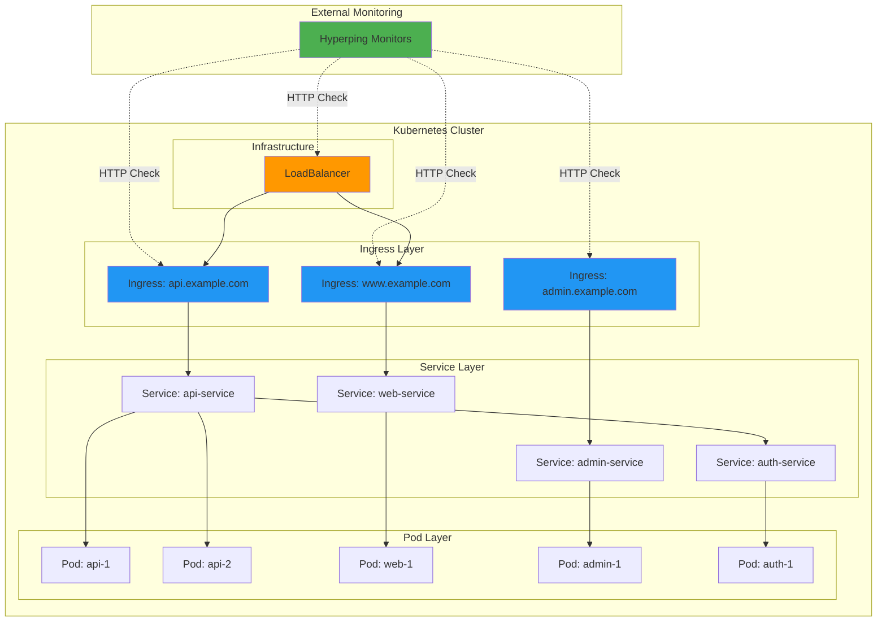

# Monitoring Kubernetes with Terraform

Learn how to implement comprehensive monitoring for Kubernetes clusters using the Hyperping Terraform provider integrated with the Kubernetes provider.

## The Challenge

Kubernetes environments introduce monitoring complexity:

- **Dynamic Workloads**: Pods and services change frequently
- **Ingress Routing**: Multiple ingress controllers and routes to monitor
- **Service Discovery**: Services exposed via LoadBalancers, NodePorts, or Ingress
- **Multi-Cluster**: Production, staging, and development clusters
- **Health Endpoints**: Readiness and liveness probes need external validation
- **DNS Management**: Services accessible via internal and external DNS

Manual monitoring configuration doesn't scale with Kubernetes' dynamic nature. This guide shows how to use Terraform to automate monitoring of Kubernetes resources.

## Architecture



**Monitoring Layers:**
- **Ingress**: External HTTP/HTTPS endpoints
- **LoadBalancer**: External IP endpoints
- **Services**: ClusterIP, NodePort, LoadBalancer services
- **Infrastructure**: Cluster nodes, control plane

## Solution

### Prerequisites

- Terraform >= 1.0
- Hyperping account with API key
- Kubernetes cluster with external access
- kubectl configured for cluster access
- Kubernetes Terraform provider

### Step 1: Configure Providers

Set up both Hyperping and Kubernetes providers:

```hcl
# versions.tf
terraform {
  required_version = ">= 1.0"

  required_providers {
    hyperping = {
      source  = "develeap/hyperping"
      version = "~> 1.0"
    }
    kubernetes = {
      source  = "hashicorp/kubernetes"
      version = "~> 2.30"
    }
  }
}

# providers.tf
provider "hyperping" {
  # Set HYPERPING_API_KEY environment variable
}

provider "kubernetes" {
  config_path = "~/.kube/config"
  # Or use config_context for specific cluster
  # config_context = "production-cluster"
}
```

### Step 2: Monitor Ingress Resources

Automatically discover and monitor all ingress endpoints:

```hcl
# ingress-monitoring.tf
data "kubernetes_ingress_v1" "all" {
  for_each = toset(var.monitored_namespaces)

  metadata {
    namespace = each.value
  }
}

locals {
  # Extract all ingress hosts and paths
  ingress_endpoints = flatten([
    for ns, ingress_data in data.kubernetes_ingress_v1.all : [
      for ingress in try(ingress_data.items, []) : [
        for rule in try(ingress.spec[0].rule, []) : [
          for path in try(rule.http[0].path, [{ path = "/" }]) : {
            key       = "${ns}-${ingress.metadata[0].name}-${rule.host}-${replace(path.path, "/", "-")}"
            namespace = ns
            name      = ingress.metadata[0].name
            host      = rule.host
            path      = path.path
            url       = "https://${rule.host}${path.path}"
            tls       = length(try(ingress.spec[0].tls, [])) > 0
          }
        ]
      ]
    ]
  ])

  # Convert to map for for_each
  ingress_map = {
    for endpoint in local.ingress_endpoints :
    endpoint.key => endpoint
  }
}

variable "monitored_namespaces" {
  description = "Kubernetes namespaces to monitor"
  type        = list(string)
  default     = ["default", "production", "staging"]
}

resource "hyperping_monitor" "ingress" {
  for_each = local.ingress_map

  name            = "[K8S]-Ingress-${each.value.namespace}-${each.value.name}"
  url             = each.value.url
  protocol        = "http"
  http_method     = "GET"
  check_frequency = 60
  regions         = ["london", "virginia", "singapore"]

  expected_status_code = "2xx"
  follow_redirects     = true

  request_headers = [
    {
      name  = "X-Health-Check"
      value = "hyperping"
    }
  ]
}
```

### Step 3: Monitor LoadBalancer Services

Monitor services exposed via LoadBalancer:

```hcl
# loadbalancer-monitoring.tf
data "kubernetes_service_v1" "loadbalancers" {
  for_each = toset(var.monitored_namespaces)

  metadata {
    namespace = each.value
  }
}

locals {
  # Extract LoadBalancer services with external IPs
  loadbalancer_services = flatten([
    for ns, svc_data in data.kubernetes_service_v1.loadbalancers : [
      for svc in try(svc_data.items, []) : {
        key            = "${ns}-${svc.metadata[0].name}"
        namespace      = ns
        name           = svc.metadata[0].name
        external_ip    = try(svc.status[0].load_balancer[0].ingress[0].ip, "")
        external_host  = try(svc.status[0].load_balancer[0].ingress[0].hostname, "")
        port           = try(svc.spec[0].port[0].port, 80)
        protocol       = lower(try(svc.spec[0].port[0].protocol, "TCP"))
      }
      if svc.spec[0].type == "LoadBalancer" &&
         (try(svc.status[0].load_balancer[0].ingress[0].ip, "") != "" ||
          try(svc.status[0].load_balancer[0].ingress[0].hostname, "") != "")
    ]
  ])

  loadbalancer_map = {
    for svc in local.loadbalancer_services :
    svc.key => svc
  }
}

resource "hyperping_monitor" "loadbalancer" {
  for_each = local.loadbalancer_map

  name     = "[K8S]-LB-${each.value.namespace}-${each.value.name}"
  protocol = each.value.protocol == "tcp" ? "port" : "http"

  # Use external IP or hostname
  url = each.value.protocol == "tcp" ? (
    "tcp://${coalesce(each.value.external_ip, each.value.external_host)}:${each.value.port}"
  ) : (
    "http://${coalesce(each.value.external_ip, each.value.external_host)}:${each.value.port}"
  )

  port            = each.value.protocol == "tcp" ? each.value.port : null
  check_frequency = 60
  regions         = ["london", "virginia"]
}
```

### Step 4: Monitor Specific Services

Monitor critical services by label selector:

```hcl
# service-monitoring.tf
variable "critical_service_labels" {
  description = "Label selector for critical services to monitor"
  type        = map(string)
  default = {
    monitoring = "enabled"
    tier       = "production"
  }
}

data "kubernetes_service_v1" "critical" {
  for_each = toset(var.monitored_namespaces)

  metadata {
    namespace = each.value
    labels    = var.critical_service_labels
  }
}

locals {
  critical_services = flatten([
    for ns, svc_data in data.kubernetes_service_v1.critical : [
      for svc in try(svc_data.items, []) : {
        key       = "${ns}-${svc.metadata[0].name}"
        namespace = ns
        name      = svc.metadata[0].name
        # Build URL from service annotations
        health_path = try(svc.metadata[0].annotations["hyperping.io/health-path"], "/health")
        domain      = try(svc.metadata[0].annotations["hyperping.io/domain"], "")
      }
      if try(svc.metadata[0].annotations["hyperping.io/domain"], "") != ""
    ]
  ])

  critical_services_map = {
    for svc in local.critical_services :
    svc.key => svc
  }
}

resource "hyperping_monitor" "critical_service" {
  for_each = local.critical_services_map

  name            = "[K8S]-Service-${each.value.namespace}-${each.value.name}"
  url             = "https://${each.value.domain}${each.value.health_path}"
  protocol        = "http"
  http_method     = "GET"
  check_frequency = 30
  regions         = ["london", "virginia", "singapore", "tokyo"]

  expected_status_code = "2xx"
}
```

### Step 5: Create Status Page

Set up a status page for your Kubernetes services:

```hcl
# statuspage.tf
variable "cluster_name" {
  description = "Kubernetes cluster name"
  type        = string
  default     = "production"
}

resource "hyperping_statuspage" "kubernetes" {
  name      = "${title(var.cluster_name)} Kubernetes Services"
  subdomain = "${var.cluster_name}-k8s"
  theme     = "dark"

  sections = [
    {
      name = {
        en = "Ingress Endpoints"
      }
      is_split = true
      services = [
        for k, v in hyperping_monitor.ingress : {
          monitor_uuid        = v.id
          show_uptime         = true
          show_response_times = true
        }
      ]
    },
    {
      name = {
        en = "LoadBalancer Services"
      }
      is_split = true
      services = [
        for k, v in hyperping_monitor.loadbalancer : {
          monitor_uuid        = v.id
          show_uptime         = true
          show_response_times = false
        }
      ]
    },
    {
      name = {
        en = "Critical Services"
      }
      is_split = true
      services = [
        for k, v in hyperping_monitor.critical_service : {
          monitor_uuid        = v.id
          show_uptime         = true
          show_response_times = true
        }
      ]
    }
  ]
}

output "k8s_status_page_url" {
  description = "Kubernetes services status page URL"
  value       = "https://${hyperping_statuspage.kubernetes.subdomain}.hyperping.app"
}
```

## Complete Example

Here's a complete, working example for monitoring a Kubernetes cluster:

```hcl
# main.tf
terraform {
  required_version = ">= 1.0"

  required_providers {
    hyperping = {
      source  = "develeap/hyperping"
      version = "~> 1.0"
    }
    kubernetes = {
      source  = "hashicorp/kubernetes"
      version = "~> 2.30"
    }
  }
}

provider "hyperping" {
  # Set HYPERPING_API_KEY environment variable
}

provider "kubernetes" {
  config_path    = "~/.kube/config"
  config_context = var.kube_context
}

variable "kube_context" {
  description = "Kubernetes context to use"
  type        = string
  default     = "production-cluster"
}

variable "cluster_name" {
  description = "Cluster name for monitoring labels"
  type        = string
  default     = "production"
}

# Monitor all ingress resources in production namespace
data "kubernetes_ingress_v1" "production" {
  metadata {
    namespace = "production"
  }
}

locals {
  # Extract ingress hosts
  ingress_hosts = flatten([
    for ingress in try(data.kubernetes_ingress_v1.production.items, []) : [
      for rule in try(ingress.spec[0].rule, []) : {
        key  = "${ingress.metadata[0].name}-${rule.host}"
        name = ingress.metadata[0].name
        host = rule.host
        url  = "https://${rule.host}/health"
      }
    ]
  ])

  ingress_map = {
    for endpoint in local.ingress_hosts :
    endpoint.key => endpoint
  }
}

resource "hyperping_monitor" "k8s_ingress" {
  for_each = local.ingress_map

  name            = "[K8S]-${var.cluster_name}-${each.value.name}"
  url             = each.value.url
  protocol        = "http"
  check_frequency = 60
  regions         = ["london", "virginia"]

  expected_status_code = "2xx"
  follow_redirects     = true
}

resource "hyperping_statuspage" "cluster" {
  name      = "${title(var.cluster_name)} Cluster Status"
  subdomain = "${var.cluster_name}-cluster"
  theme     = "dark"

  sections = [{
    name = { en = "Kubernetes Services" }
    is_split = true
    services = [
      for k, v in hyperping_monitor.k8s_ingress : {
        monitor_uuid        = v.id
        show_uptime         = true
        show_response_times = true
      }
    ]
  }]
}

output "status_page" {
  description = "Status page URL"
  value       = "https://${hyperping_statuspage.cluster.subdomain}.hyperping.app"
}

output "monitored_endpoints" {
  description = "All monitored endpoints"
  value = {
    for k, v in hyperping_monitor.k8s_ingress : k => {
      id   = v.id
      name = v.name
      url  = v.url
    }
  }
}
```

**Usage:**

```bash
# Set credentials
export HYPERPING_API_KEY="sk_your_api_key"
export KUBECONFIG="~/.kube/config"

# Initialize
terraform init

# Plan
terraform plan -var="cluster_name=production"

# Apply
terraform apply -var="cluster_name=production"

# Check outputs
terraform output status_page
terraform output monitored_endpoints
```

## Customization

### Monitor Multiple Clusters

Use workspaces or separate configurations:

```hcl
# multi-cluster/main.tf
variable "clusters" {
  description = "Kubernetes clusters to monitor"
  type = map(object({
    context    = string
    namespaces = list(string)
  }))

  default = {
    production = {
      context    = "prod-us-east"
      namespaces = ["default", "production"]
    }
    staging = {
      context    = "staging-us-west"
      namespaces = ["default", "staging"]
    }
  }
}

# Create provider aliases for each cluster
provider "kubernetes" {
  alias       = "production"
  config_path = "~/.kube/config"
  config_context = var.clusters.production.context
}

provider "kubernetes" {
  alias       = "staging"
  config_path = "~/.kube/config"
  config_context = var.clusters.staging.context
}
```

### Add Authentication Headers

For services requiring authentication:

```hcl
# Use Kubernetes secrets for auth tokens
data "kubernetes_secret_v1" "health_check_token" {
  metadata {
    name      = "hyperping-health-token"
    namespace = "production"
  }
}

resource "hyperping_monitor" "authenticated_service" {
  name            = "[K8S]-AuthService"
  url             = "https://api.example.com/health"
  protocol        = "http"
  check_frequency = 60
  regions         = ["london", "virginia"]

  request_headers = [
    {
      name  = "Authorization"
      value = "Bearer ${data.kubernetes_secret_v1.health_check_token.data["token"]}"
    }
  ]
}
```

### Service Mesh Integration

Monitor Istio or Linkerd service mesh endpoints:

```hcl
# Monitor Istio virtual services
data "kubernetes_resource" "virtualservices" {
  api_version = "networking.istio.io/v1beta1"
  kind        = "VirtualService"

  metadata {
    namespace = "production"
  }
}

locals {
  # Extract virtual service hosts
  vs_hosts = flatten([
    for vs in data.kubernetes_resource.virtualservices.items : [
      for host in try(vs.spec.hosts, []) : {
        key  = "${vs.metadata.name}-${host}"
        name = vs.metadata.name
        host = host
        url  = "https://${host}/health"
      }
      if !can(regex("^\\*\\.", host))  # Skip wildcard hosts
    ]
  ])
}
```

### Helm Chart Integration

Monitor applications deployed via Helm:

```hcl
# Get Helm releases
data "helm_release" "apps" {
  for_each = toset(["app1", "app2", "app3"])

  name      = each.value
  namespace = "production"
}

locals {
  # Extract service URLs from Helm values
  helm_services = {
    for name, release in data.helm_release.apps :
    name => {
      url = try(
        yamldecode(release.metadata[0].values)["ingress"]["host"],
        "${name}.example.com"
      )
      health_path = try(
        yamldecode(release.metadata[0].values)["healthCheck"]["path"],
        "/health"
      )
    }
  }
}

resource "hyperping_monitor" "helm_apps" {
  for_each = local.helm_services

  name            = "[K8S]-Helm-${each.key}"
  url             = "https://${each.value.url}${each.value.health_path}"
  protocol        = "http"
  check_frequency = 60
  regions         = ["london", "virginia"]
}
```

## Best Practices

### 1. Use Kubernetes Annotations

Add monitoring metadata to Kubernetes resources:

```yaml
# kubernetes-manifest.yaml
apiVersion: networking.k8s.io/v1
kind: Ingress
metadata:
  name: api-ingress
  namespace: production
  annotations:
    hyperping.io/enabled: "true"
    hyperping.io/frequency: "30"
    hyperping.io/regions: "london,virginia,singapore"
    hyperping.io/health-path: "/health"
spec:
  rules:
    - host: api.example.com
      # ...
```

```hcl
# Read annotations in Terraform
resource "hyperping_monitor" "annotated_ingress" {
  for_each = {
    for k, v in local.ingress_map : k => v
    if try(v.annotations["hyperping.io/enabled"], "false") == "true"
  }

  name = "[K8S]-${each.value.name}"
  url  = "https://${each.value.host}${try(each.value.annotations["hyperping.io/health-path"], "/")}"

  check_frequency = tonumber(
    try(each.value.annotations["hyperping.io/frequency"], "60")
  )

  regions = split(",",
    try(each.value.annotations["hyperping.io/regions"], "london,virginia")
  )
}
```

### 2. Namespace Isolation

Monitor namespaces independently:

```hcl
# Separate monitors by namespace for easier management
locals {
  namespace_prefix = {
    production = "[PROD]"
    staging    = "[STAGE]"
    development = "[DEV]"
  }
}

resource "hyperping_monitor" "namespace_services" {
  for_each = local.ingress_map

  name = "${local.namespace_prefix[each.value.namespace]}-${each.value.name}"
  # ...
}
```

### 3. Conditional Monitoring

Only monitor production-ready services:

```hcl
locals {
  # Only monitor ingresses with TLS configured
  production_ingress = {
    for k, v in local.ingress_map : k => v
    if v.tls == true && v.namespace == "production"
  }
}
```

### 4. Dynamic Region Selection

Adjust regions based on cluster location:

```hcl
variable "cluster_region" {
  description = "Primary cluster region"
  type        = string
  default     = "us-east"
}

locals {
  region_mapping = {
    "us-east" = ["virginia", "london", "singapore"]
    "eu-west" = ["london", "frankfurt", "virginia"]
    "ap-south" = ["singapore", "tokyo", "sydney"]
  }

  monitoring_regions = local.region_mapping[var.cluster_region]
}

resource "hyperping_monitor" "regional" {
  # ...
  regions = local.monitoring_regions
}
```

### 5. GitOps Integration

Commit Terraform configurations alongside Kubernetes manifests:

```
repository/
├── k8s/
│   ├── base/
│   │   ├── deployment.yaml
│   │   ├── service.yaml
│   │   └── ingress.yaml
│   └── overlays/
│       ├── production/
│       └── staging/
└── terraform/
    ├── monitoring/
    │   ├── main.tf
    │   ├── variables.tf
    │   └── outputs.tf
    └── environments/
        ├── production.tfvars
        └── staging.tfvars
```

## Troubleshooting

### Issue: Ingress Data Not Found

**Problem:** `data.kubernetes_ingress_v1.all` returns empty.

**Solution:** Verify namespace and RBAC permissions:

```bash
# Check ingress resources
kubectl get ingress -n production

# Verify Terraform can access cluster
terraform console
> data.kubernetes_ingress_v1.all

# Check service account permissions (if using in-cluster config)
kubectl auth can-i get ingress --as=system:serviceaccount:default:terraform
```

### Issue: External IP Not Available

**Problem:** LoadBalancer service has no external IP.

**Solution:** Wait for external IP assignment or use NodePort:

```hcl
# Add timeout for LoadBalancer provisioning
resource "time_sleep" "wait_for_lb" {
  create_duration = "60s"

  depends_on = [kubernetes_service.app]
}

data "kubernetes_service_v1" "app_lb" {
  metadata {
    name      = kubernetes_service.app.metadata[0].name
    namespace = kubernetes_service.app.metadata[0].namespace
  }

  depends_on = [time_sleep.wait_for_lb]
}
```

### Issue: Certificate Errors for HTTPS

**Problem:** Monitors fail with TLS certificate errors.

**Solution:** Ensure certificates are valid:

```bash
# Test certificate
curl -v https://api.example.com/health

# If using Let's Encrypt, verify cert-manager
kubectl get certificate -n production
kubectl describe certificate api-tls -n production
```

### Issue: Health Endpoints Return 404

**Problem:** Health paths not matching actual endpoints.

**Solution:** Verify paths using service annotations:

```yaml
apiVersion: v1
kind: Service
metadata:
  name: api-service
  annotations:
    hyperping.io/health-path: "/api/health"  # Actual health endpoint
```

### Issue: Too Many Monitors Created

**Problem:** Monitoring every ingress path creates too many monitors.

**Solution:** Filter to root paths only:

```hcl
locals {
  # Only monitor root-level ingress paths
  root_ingress = [
    for endpoint in local.ingress_endpoints :
    endpoint
    if endpoint.path == "/" || endpoint.path == ""
  ]
}
```

## Next Steps

- **[Microservices Monitoring Guide](./use-case-microservices.md)** - Monitor service mesh architectures
- **[API Gateway Monitoring Guide](./use-case-api-gateway.md)** - Monitor Kong, NGINX, Traefik
- **[Importing Resources Guide](./importing-resources.md)** - Import existing monitors
- **[Error Handling Guide](./error-handling.md)** - Handle monitoring failures

## Additional Resources

- [Kubernetes Provider Documentation](https://registry.terraform.io/providers/hashicorp/kubernetes/latest/docs)
- [Hyperping Provider Documentation](https://registry.terraform.io/providers/develeap/hyperping/latest/docs)
- [Kubernetes Health Checks Best Practices](https://kubernetes.io/docs/tasks/configure-pod-container/configure-liveness-readiness-startup-probes/)
- [GitOps with Terraform](https://www.terraform.io/docs/cloud/guides/recommended-practices/part1.html)
