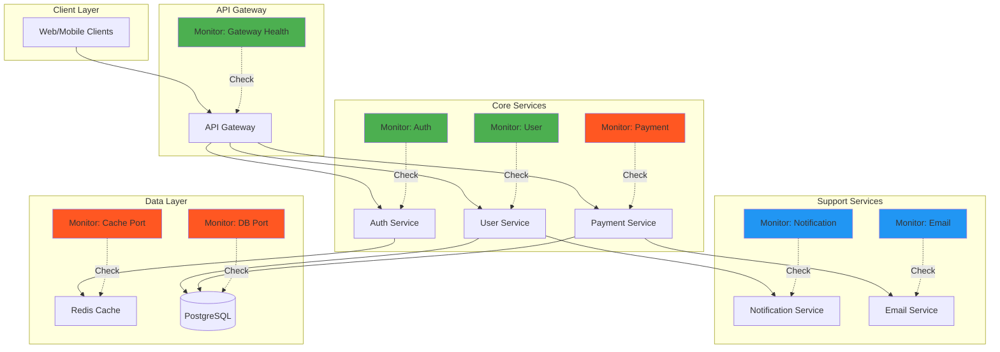

# Monitoring Microservices with Terraform

Learn how to implement comprehensive monitoring for microservices architectures using the Hyperping Terraform provider.

## The Challenge

Microservices architectures present unique monitoring challenges:

- **Scale**: Dozens or hundreds of services to monitor
- **Dependencies**: Services depend on each other, requiring dependency-aware monitoring
- **Complexity**: Different protocols, authentication methods, and health check patterns
- **Criticality Levels**: Not all services are equally critical to business operations
- **Regional Deployment**: Services deployed across multiple regions for redundancy

Traditional manual monitoring configuration becomes error-prone and difficult to maintain at scale. Infrastructure-as-code with Terraform provides a scalable, version-controlled solution.

## Architecture



**Legend:**
- Green: Critical services (30s checks)
- Orange: High priority (60s checks)
- Blue: Standard priority (300s checks)

## Solution

### Prerequisites

- Terraform >= 1.0
- Hyperping account with API key
- Access to service health endpoints
- Understanding of service dependencies

### Step 1: Define Service Inventory

Create a structured inventory of your services with their monitoring requirements:

```hcl
# variables.tf
variable "environment" {
  description = "Environment name (dev, staging, production)"
  type        = string
  default     = "production"
}

variable "services" {
  description = "Service monitoring configuration"
  type = map(object({
    url              = string
    protocol         = string
    http_method      = optional(string, "GET")
    critical         = bool
    check_frequency  = number
    regions          = list(string)
    request_headers  = optional(list(object({
      name  = string
      value = string
    })), [])
    expected_status_code = optional(string, "2xx")
  }))
}

# terraform.tfvars
environment = "production"

services = {
  api_gateway = {
    url             = "https://api.example.com/health"
    protocol        = "http"
    critical        = true
    check_frequency = 30
    regions         = ["london", "virginia", "singapore", "tokyo"]
    request_headers = [
      {
        name  = "X-Health-Check"
        value = "hyperping"
      }
    ]
  }

  auth_service = {
    url             = "https://auth.example.com/health"
    protocol        = "http"
    critical        = true
    check_frequency = 30
    regions         = ["london", "virginia", "singapore"]
  }

  user_service = {
    url             = "https://users.example.com/health"
    protocol        = "http"
    critical        = true
    check_frequency = 60
    regions         = ["london", "virginia", "singapore"]
  }

  payment_service = {
    url             = "https://payments.example.com/health"
    protocol        = "http"
    critical        = true
    check_frequency = 30
    regions         = ["london", "virginia", "singapore", "tokyo"]
  }

  notification_service = {
    url             = "https://notifications.example.com/health"
    protocol        = "http"
    critical        = false
    check_frequency = 300
    regions         = ["london", "virginia"]
  }

  email_service = {
    url             = "https://email.example.com/health"
    protocol        = "http"
    critical        = false
    check_frequency = 300
    regions         = ["virginia"]
  }
}
```

### Step 2: Create Dynamic Monitors

Use `for_each` to create monitors dynamically from your service inventory:

```hcl
# main.tf
terraform {
  required_version = ">= 1.0"

  required_providers {
    hyperping = {
      source  = "develeap/hyperping"
      version = "~> 1.0"
    }
  }
}

provider "hyperping" {
  # Set HYPERPING_API_KEY environment variable
}

locals {
  # Create standardized naming convention
  name_prefix = "[${upper(var.environment)}]"

  # Group services by criticality for easier management
  critical_services = {
    for k, v in var.services : k => v if v.critical
  }

  standard_services = {
    for k, v in var.services : k => v if !v.critical
  }
}

# Create monitors for all services
resource "hyperping_monitor" "services" {
  for_each = var.services

  name            = "${local.name_prefix}-${replace(title(replace(each.key, "_", " ")), " ", "")}"
  url             = each.value.url
  protocol        = each.value.protocol
  http_method     = each.value.http_method
  check_frequency = each.value.check_frequency
  regions         = each.value.regions

  expected_status_code = each.value.expected_status_code
  follow_redirects     = true

  request_headers = each.value.request_headers
}
```

### Step 3: Add Infrastructure Layer Monitoring

Monitor critical infrastructure components like databases and caches:

```hcl
# infrastructure.tf
variable "infrastructure" {
  description = "Infrastructure component monitoring"
  type = map(object({
    url      = string
    protocol = string
    port     = number
    regions  = list(string)
  }))

  default = {
    redis_cache = {
      url      = "tcp://cache.example.com:6379"
      protocol = "port"
      port     = 6379
      regions  = ["london", "virginia"]
    }

    postgres_db = {
      url      = "tcp://db.example.com:5432"
      protocol = "port"
      port     = 5432
      regions  = ["london", "virginia"]
    }
  }
}

resource "hyperping_monitor" "infrastructure" {
  for_each = var.infrastructure

  name            = "${local.name_prefix}-Infra-${replace(title(replace(each.key, "_", " ")), " ", "")}"
  url             = each.value.url
  protocol        = each.value.protocol
  port            = each.value.port
  check_frequency = 60
  regions         = each.value.regions
}
```

### Step 4: Create Status Page for Service Visibility

Set up a status page to display service health:

```hcl
# statuspage.tf
resource "hyperping_statuspage" "microservices" {
  name      = "${var.environment} Microservices Status"
  subdomain = "${var.environment}-services"
  theme     = "dark"

  sections = [
    {
      name = {
        en = "Core Services"
      }
      is_split = true
      services = [
        for key in ["api_gateway", "auth_service", "user_service", "payment_service"] : {
          monitor_uuid        = hyperping_monitor.services[key].id
          show_uptime         = true
          show_response_times = true
        } if contains(keys(hyperping_monitor.services), key)
      ]
    },
    {
      name = {
        en = "Support Services"
      }
      is_split = true
      services = [
        for key in ["notification_service", "email_service"] : {
          monitor_uuid        = hyperping_monitor.services[key].id
          show_uptime         = true
          show_response_times = false
        } if contains(keys(hyperping_monitor.services), key)
      ]
    },
    {
      name = {
        en = "Infrastructure"
      }
      is_split = false
      services = [
        for monitor in hyperping_monitor.infrastructure : {
          monitor_uuid        = monitor.id
          show_uptime         = true
          show_response_times = false
        }
      ]
    }
  ]
}

output "status_page_url" {
  description = "Public status page URL"
  value       = "https://${hyperping_statuspage.microservices.subdomain}.hyperping.app"
}
```

### Step 5: Configure Team Notifications

Add email notifications for the team:

```hcl
# notifications.tf
variable "team_emails" {
  description = "Team email addresses for status updates"
  type        = list(string)
  default = [
    "devops@example.com",
    "sre@example.com"
  ]
}

resource "hyperping_statuspage_subscriber" "team_email" {
  for_each = toset(var.team_emails)

  statuspage_uuid = hyperping_statuspage.microservices.id
  type            = "email"
  email           = each.value
}
```

## Complete Example

Here's a full working example you can use as a starting point:

```hcl
# versions.tf
terraform {
  required_version = ">= 1.0"

  required_providers {
    hyperping = {
      source  = "develeap/hyperping"
      version = "~> 1.0"
    }
  }
}

# main.tf
provider "hyperping" {
  # Set HYPERPING_API_KEY environment variable
}

locals {
  name_prefix = "[${upper(var.environment)}]"

  critical_services = {
    for k, v in var.services : k => v if v.critical
  }
}

variable "environment" {
  description = "Environment name"
  type        = string
  default     = "production"
}

variable "services" {
  description = "Microservices to monitor"
  type = map(object({
    url             = string
    critical        = bool
    check_frequency = number
    regions         = list(string)
  }))

  default = {
    api_gateway = {
      url             = "https://api.example.com/health"
      critical        = true
      check_frequency = 30
      regions         = ["london", "virginia", "singapore"]
    }
    auth_service = {
      url             = "https://auth.example.com/health"
      critical        = true
      check_frequency = 30
      regions         = ["london", "virginia", "singapore"]
    }
    user_service = {
      url             = "https://users.example.com/health"
      critical        = true
      check_frequency = 60
      regions         = ["london", "virginia"]
    }
    payment_service = {
      url             = "https://payments.example.com/health"
      critical        = true
      check_frequency = 30
      regions         = ["london", "virginia", "singapore"]
    }
    notification_service = {
      url             = "https://notifications.example.com/health"
      critical        = false
      check_frequency = 300
      regions         = ["virginia"]
    }
  }
}

resource "hyperping_monitor" "services" {
  for_each = var.services

  name                 = "${local.name_prefix}-${replace(title(replace(each.key, "_", " ")), " ", "")}"
  url                  = each.value.url
  protocol             = "http"
  http_method          = "GET"
  check_frequency      = each.value.check_frequency
  regions              = each.value.regions
  expected_status_code = "2xx"
  follow_redirects     = true
}

resource "hyperping_statuspage" "main" {
  name      = "${var.environment} Services"
  subdomain = "${var.environment}-api"
  theme     = "dark"

  sections = [{
    name = { en = "API Services" }
    is_split = true
    services = [
      for k, v in hyperping_monitor.services : {
        monitor_uuid        = v.id
        show_uptime         = true
        show_response_times = var.services[k].critical
      }
    ]
  }]
}

output "monitors" {
  description = "Created monitors"
  value = {
    for k, v in hyperping_monitor.services : k => {
      id        = v.id
      name      = v.name
      url       = v.url
      frequency = v.check_frequency
      critical  = var.services[k].critical
    }
  }
}

output "status_page_url" {
  description = "Status page URL"
  value       = "https://${hyperping_statuspage.main.subdomain}.hyperping.app"
}

output "critical_monitor_count" {
  description = "Number of critical service monitors"
  value       = length(local.critical_services)
}
```

**Usage:**

```bash
# Set API key
export HYPERPING_API_KEY="sk_your_api_key"

# Initialize
terraform init

# Plan
terraform plan

# Apply
terraform apply

# View outputs
terraform output status_page_url
terraform output monitors
```

## Customization

### Adjust Check Frequencies

Optimize for your SLA requirements and budget:

```hcl
# High-frequency for critical user-facing services
payment_service = {
  check_frequency = 10  # Every 10 seconds
  # ...
}

# Standard frequency for internal services
notification_service = {
  check_frequency = 300  # Every 5 minutes
  # ...
}
```

### Add Authentication

For services requiring authentication:

```hcl
services = {
  api_gateway = {
    url             = "https://api.example.com/health"
    request_headers = [
      {
        name  = "Authorization"
        value = "Bearer ${var.health_check_token}"
      },
      {
        name  = "X-Health-Check"
        value = "true"
      }
    ]
    # ...
  }
}

# Store token securely
variable "health_check_token" {
  description = "Health check authentication token"
  type        = string
  sensitive   = true
}
```

### Regional Optimization

Customize regions based on your deployment:

```hcl
locals {
  # Define regional tiers
  tier1_regions = ["london", "virginia", "singapore", "tokyo"]
  tier2_regions = ["london", "virginia"]

  # Auto-assign based on criticality
  optimized_services = {
    for k, v in var.services : k => merge(v, {
      regions = v.critical ? local.tier1_regions : local.tier2_regions
    })
  }
}

resource "hyperping_monitor" "services" {
  for_each = local.optimized_services
  # Use optimized configuration
  regions = each.value.regions
  # ...
}
```

### Environment-Specific Configuration

Use workspaces or separate tfvars files:

```bash
# Production
terraform apply -var-file="production.tfvars"

# Staging
terraform apply -var-file="staging.tfvars"
```

```hcl
# production.tfvars
environment = "production"
services = {
  api_gateway = {
    url             = "https://api.example.com/health"
    check_frequency = 30
    # ...
  }
}

# staging.tfvars
environment = "staging"
services = {
  api_gateway = {
    url             = "https://staging-api.example.com/health"
    check_frequency = 60
    # ...
  }
}
```

## Best Practices

### 1. Use Consistent Naming Conventions

Establish a naming pattern for easy identification:

```hcl
# Pattern: [ENVIRONMENT]-ServiceName
# Examples:
# - [PROD]-ApiGateway
# - [STAGING]-AuthService
# - [DEV]-PaymentService

locals {
  name_prefix = "[${upper(var.environment)}]"
}
```

### 2. Group Services by Criticality

Separate critical from non-critical services for easier management:

```hcl
locals {
  critical_services = {
    for k, v in var.services : k => v if v.critical
  }

  standard_services = {
    for k, v in var.services : k => v if !v.critical
  }
}

# Create separate status page sections
sections = [
  {
    name     = { en = "Critical Services" }
    services = [for k, v in local.critical_services : {...}]
  },
  {
    name     = { en = "Standard Services" }
    services = [for k, v in local.standard_services : {...}]
  }
]
```

### 3. Implement Service Dependencies

Monitor dependencies explicitly:

```hcl
# If user service depends on auth service, ensure both are monitored
resource "hyperping_monitor" "user_service" {
  # User service health depends on auth being healthy
  name = "${local.name_prefix}-UserService"
  # ...
}

resource "hyperping_monitor" "auth_service" {
  name = "${local.name_prefix}-AuthService"
  # ...
}
```

### 4. Use Data Sources for Dynamic Configuration

Fetch existing monitors for integration:

```hcl
data "hyperping_monitors" "existing" {
  filter = {
    name_regex = "\\[${upper(var.environment)}\\]-.*"
  }
}

# Use existing monitor IDs in maintenance windows
resource "hyperping_maintenance" "deployment" {
  name     = "Service Deployment"
  monitors = [for m in data.hyperping_monitors.existing.monitors : m.id]
  # ...
}
```

### 5. Validate Configuration

Add validation rules to prevent misconfigurations:

```hcl
variable "services" {
  validation {
    condition = alltrue([
      for k, v in var.services :
      contains([10, 20, 30, 60, 120, 300, 600, 1800, 3600], v.check_frequency)
    ])
    error_message = "Check frequency must be a valid value: 10, 20, 30, 60, 120, 300, 600, 1800, or 3600 seconds."
  }

  validation {
    condition = alltrue([
      for k, v in var.services :
      length(v.regions) > 0
    ])
    error_message = "Each service must have at least one monitoring region."
  }
}
```

## Troubleshooting

### Issue: Too Many Monitors Created

**Problem:** You've exceeded your plan's monitor limit.

**Solution:** Consolidate non-critical services or increase check intervals:

```hcl
# Reduce frequency for non-critical services
locals {
  optimized_services = {
    for k, v in var.services : k => merge(v, {
      check_frequency = v.critical ? v.check_frequency : max(v.check_frequency, 300)
    })
  }
}
```

### Issue: Monitors Failing After Deployment

**Problem:** Health endpoints return 503 during deployment.

**Solution:** Create maintenance windows for deployments:

```hcl
resource "hyperping_maintenance" "deployment" {
  name       = "Rolling Deployment - ${timestamp()}"
  start_date = timeadd(timestamp(), "5m")
  end_date   = timeadd(timestamp(), "30m")
  monitors   = [for k, v in local.critical_services : hyperping_monitor.services[k].id]
}
```

### Issue: Authentication Tokens in State

**Problem:** Sensitive tokens stored in Terraform state.

**Solution:** Use environment variables or external secret management:

```hcl
# Use environment variable
variable "health_check_token" {
  type      = string
  sensitive = true
  # Set via: export TF_VAR_health_check_token=xxx
}

# Or use external secret provider
data "aws_secretsmanager_secret_version" "health_token" {
  secret_id = "hyperping/health-check-token"
}

locals {
  health_token = jsondecode(data.aws_secretsmanager_secret_version.health_token.secret_string)["token"]
}
```

### Issue: Status Page Not Showing All Services

**Problem:** Some monitors missing from status page.

**Solution:** Verify monitor creation and section configuration:

```bash
# List all created monitors
terraform state list | grep hyperping_monitor

# Check specific monitor
terraform state show 'hyperping_monitor.services["api_gateway"]'

# Verify status page sections
terraform state show hyperping_statuspage.microservices
```

### Issue: Regional Performance Differences

**Problem:** One region consistently slower than others.

**Solution:** Add region-specific monitoring and investigate:

```hcl
# Create per-region monitors for troubleshooting
resource "hyperping_monitor" "regional_test" {
  for_each = toset(["london", "virginia", "singapore"])

  name            = "${local.name_prefix}-RegionalTest-${title(each.key)}"
  url             = "https://api.example.com/health"
  check_frequency = 60
  regions         = [each.value]  # Single region per monitor
}

# Check response times
data "hyperping_monitor_report" "regional_performance" {
  for_each = hyperping_monitor.regional_test

  monitor_uuid = each.value.id
  days         = 7
}
```

## Next Steps

- **[Kubernetes Monitoring Guide](./use-case-kubernetes.md)** - Monitor K8s ingress and services
- **[API Gateway Monitoring Guide](./use-case-api-gateway.md)** - Monitor API gateway endpoints
- **[Advanced Patterns](../../examples/advanced-patterns/)** - More complex configurations
- **[Error Handling Guide](./error-handling.md)** - Handle failures gracefully
- **[Filtering Data Sources](./filtering-data-sources.md)** - Query existing monitors

## Additional Resources

- [Hyperping Provider Documentation](https://registry.terraform.io/providers/develeap/hyperping/latest/docs)
- [Microservices Health Check Patterns](https://microservices.io/patterns/observability/health-check-api.html)
- [Terraform Best Practices](https://www.terraform-best-practices.com/)
