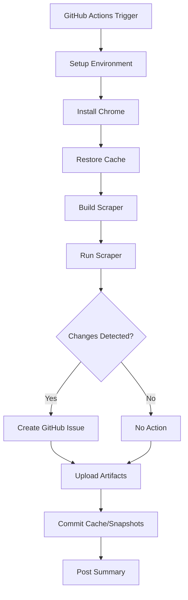

# Automated Scraper Setup Guide

This guide explains how the scraper runs automatically in GitHub Actions.

## Quick Start

**The scraper is already configured!** It will run automatically every day at 2 AM UTC.

No setup required - just push the workflow file to your repository and it works.

## How It Works

### Workflow File
`.github/workflows/scraper.yml`

### Triggers

1. **Scheduled (Daily)**
   - Runs at 2 AM UTC every day
   - Uses cron: `0 2 * * *`

2. **Manual**
   - Go to Actions tab → "API Documentation Scraper" → "Run workflow"
   - Choose log level (debug/info/warn/error)

3. **On Push (Testing)**
   - Triggers when you modify scraper code
   - Useful for testing changes

### What It Does



## Artifacts

All runs upload artifacts (downloadable from Actions UI):

| Artifact | Contents | Retention |
|----------|----------|-----------|
| `scraper-logs-{run}` | JSON formatted logs | 30 days |
| `diff-reports-{run}` | Markdown diff reports | 90 days |
| `scraped-data-{run}` | Raw JSON scraped data | 7 days |

## GitHub Issues

When API changes are detected:

**Automatically created with:**
- Title: `API Changes Detected - [timestamp]`
- Labels: `api-change`, section labels, `breaking-change` (if applicable)
- Body: Full markdown diff report
- Assignees: None (configure in workflow if needed)

**Example Issue:**
```markdown
# API Changes Detected - 2026-02-03 15:30:00

## Summary
2 endpoints changed, 1 breaking change

## Breaking Changes
### monitors/create - POST
- **Removed Parameter**: `legacy_mode` (boolean, required)

## Non-Breaking Changes
### incidents/list - GET
- **Added Parameter**: `page_size` (integer, optional, default: 20)
```

## Customization

### Change Schedule

Edit `.github/workflows/scraper.yml`:

```yaml
on:
  schedule:
    - cron: '0 2 * * *'  # Daily at 2 AM UTC
```

**Cron Examples:**
- Every 6 hours: `0 */6 * * *`
- Weekdays at 9 AM: `0 9 * * 1-5`
- Twice daily (2 AM & 2 PM): `0 2,14 * * *`
- Every Monday at midnight: `0 0 * * 1`

### Environment Variables

Available in workflow:

```yaml
env:
  GITHUB_TOKEN: ${{ secrets.GITHUB_TOKEN }}     # Auto-provided
  GITHUB_OWNER: ${{ github.repository_owner }}  # Auto-detected
  GITHUB_REPO: ${{ github.event.repository.name }} # Auto-detected
  LOG_FORMAT: json                              # text or json
  LOG_LEVEL: info                               # debug/info/warn/error
```

### Add Notifications

Add Slack/Discord/Email notifications on failure:

```yaml
- name: Notify on failure
  if: failure()
  uses: 8398a7/action-slack@v3
  with:
    status: ${{ job.status }}
    text: 'Scraper failed! Check logs.'
    webhook_url: ${{ secrets.SLACK_WEBHOOK }}
```

### Custom Assignees for Issues

Modify the `github.go` file or add to workflow:

```yaml
- name: Assign issue
  if: env.ISSUE_CREATED == 'true'
  run: |
    gh issue edit $ISSUE_NUMBER --add-assignee username1,username2
  env:
    GH_TOKEN: ${{ secrets.GITHUB_TOKEN }}
```

## Monitoring

### Job Summary

Each run creates a summary visible in Actions UI:

```
## Scraper Run Summary

**Date:** 2026-02-03 02:00:15 UTC
**Run Number:** 42
**Exit Code:** 0

### Metrics
```
Scraped: 12 (content changed)
Skipped: 35 (unchanged)
Failed: 0
Duration: 1m 23s
```

### Changes Detected
- [api_changes_2026-02-03_02-00-15.md](...)

✅ No API changes detected
```

### Check Logs

1. Go to **Actions** tab
2. Click on a workflow run
3. Click **"scrape"** job
4. Expand **"Run scraper"** step
5. View real-time logs

Or download artifacts:
- Actions → Run → Artifacts → `scraper-logs-{run}.zip`

### Cache Performance

The workflow caches between runs:
- `.scraper_cache.json` - Hash-based change detection
- `snapshots/` - Historical API snapshots
- `docs_scraped/` - Last scraped data

**Cache Key:** `scraper-data-{run_id}`
**Restore Keys:** `scraper-data-` (falls back to previous runs)

This ensures:
- Fast startup (no re-downloading)
- Accurate change detection
- Historical comparisons

## Troubleshooting

### Workflow Not Running

**Check:**
1. Workflow is enabled (Actions tab → Workflow → ...)
2. Default branch is correct (workflow runs on `main`)
3. YAML syntax is valid

### Browser Launch Fails

The workflow installs Chrome automatically:
```yaml
- name: Install Chrome
  run: |
    sudo apt-get update
    sudo apt-get install -y chromium-browser
```

If it fails, check GitHub Actions runner status.

### No Issues Created

**Possible reasons:**
1. No changes detected (cache hit)
2. GitHub token lacks permissions
3. Issue creation disabled in preview mode

**Debug:**
- Check logs: "Running in PREVIEW MODE" means no token
- Verify `GITHUB_TOKEN` is passed to scraper

### Permission Denied

The workflow commits cache/snapshots back to repo.

If it fails:
1. Check repository settings → Actions → General
2. Ensure "Read and write permissions" is enabled
3. Or use a PAT with `repo` scope

### Out of Disk Space

Artifacts accumulate over time:

**Solutions:**
- Reduce retention days in workflow
- Manually delete old artifacts (Actions → Artifacts)
- GitHub auto-deletes after retention period

## Best Practices

### 1. Monitor First Few Runs

- Check logs for unexpected behavior
- Verify cache is working (70%+ hit rate)
- Confirm issues are created correctly

### 2. Set Appropriate Schedule

- **Daily (2 AM)**: Good for most APIs
- **Hourly**: For frequently changing APIs (expensive)
- **Weekdays**: For business APIs not updated on weekends

### 3. Review Generated Issues

- Triage breaking changes quickly
- Close false positives
- Update Terraform provider accordingly

### 4. Keep Artifacts Clean

- Logs: 30 days (debug recent issues)
- Reports: 90 days (reference for changes)
- Data: 7 days (temporary, can re-scrape)

### 5. Test Changes Locally

Before pushing workflow changes:
```bash
cd tools/cmd/scraper
go build -o scraper
./scraper  # Test locally
```

## Cost Considerations

GitHub Actions is **free for public repositories**.

For private repositories:
- Free tier: 2,000 minutes/month
- Scraper run: ~5-10 minutes
- Daily runs: ~300 minutes/month
- **Conclusion: Well within free tier**

## Security

### Secrets

The workflow uses `GITHUB_TOKEN` which is:
- Automatically provided by GitHub
- Scoped to the repository
- Expires after workflow run
- No manual setup needed

### Permissions

`GITHUB_TOKEN` has access to:
- ✅ Read repository code
- ✅ Create issues
- ✅ Commit to repository
- ❌ Cannot modify settings
- ❌ Cannot delete repository

## Appendix: Workflow YAML

Full workflow file location: `.github/workflows/scraper.yml`

Key sections:
- **triggers**: When it runs
- **setup**: Environment preparation
- **scrape**: Run scraper
- **artifacts**: Upload results
- **commit**: Save cache/snapshots
- **summary**: Post results

## Support

**Issues with automation:**
1. Check workflow logs first
2. Review this guide
3. Test locally (`go run main.go`)
4. Open GitHub issue with logs

**Example debugging:**
```bash
# Download logs artifact
unzip scraper-logs-42.zip

# View JSON logs
jq . scraper.log | less

# Search for errors
grep -i error scraper.log
```
